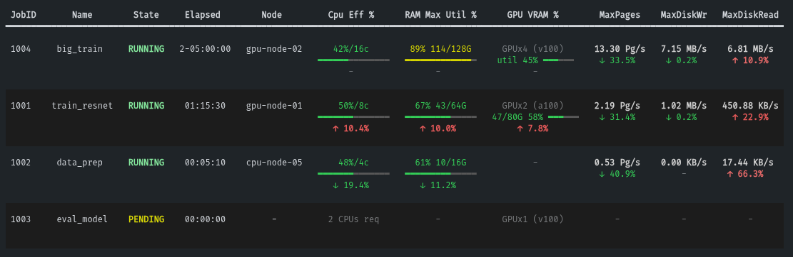

# 🕵️ SLURM Job Detective

[](https://www.python.org/)
[](https://docs.astral.sh/uv/)
[](LICENSE)
[](https://slurm.schedmd.com/)

> **Are you wasting GPU memory? Underusing CPUs? Thrashing disk?**  
> `sjdet` shows you instantly — one command, no environment to activate.



---

## Why sjdet?

HPC clusters are expensive. Running a GPU job that uses 2% of VRAM, or a CPU job at 5% utilization, wastes both your compute quota and valuable cluster resources. Normally you'd need to `ssh` into nodes, run `nvidia-smi`, parse `sstat` output, and do mental math — every time.

`sjdet` does all of that and fits it in one table:

| What you see | What it tells you |
|---|---|
| **CPU eff bar** | Are your cores actually doing work, or are they idle? |
| **Mem Use / Req + suggest** | How much RAM you're really using vs. what you requested, plus the optimal `--mem` to request next time |
| **VRAM Use / Req** | GPU memory used vs. total, with inverted color scale — green means you're filling it up as expected |
| **VRAM trend ↑↓** | Is VRAM growing, stable, or shrinking between polls? Catches memory leaks or loading phases |
| **MaxPages / MaxDisk ↑↓** | Disk thrashing and page fault trends — immediately visible |
| **Node column** | Exactly which node your job landed on, so you can `ssh` or `srun --overlap` instantly |

All of this from **two SLURM calls** (`squeue` + `sstat`), batched, with a local cache to avoid hammering the scheduler.

---

## Install

No root. No `sudo`. Works on any cluster where you have a home directory.

Requires [`uv`](https://docs.astral.sh/uv/) (recommended) or [`pipx`](https://pipx.pypa.io) — both install `sjdet` to `~/.local/bin` so you can type `sjdet` from anywhere, forever, without activating anything.

### uv (recommended)

```bash
curl -LsSf https://astral.sh/uv/install.sh | sh  # install uv itself (once)
uv tool install git+https://github.com/e-candeloro/slurm_job_detective
```

### pipx

```bash
python3 -m pip install --user pipx
pipx install git+https://github.com/e-candeloro/slurm_job_detective
```

---

## Usage

```bash
sjdet                             # auto-detects $USER, shows all your jobs
sjdet --user alice                # inspect another user's jobs
sjdet --max-jobs 20               # show up to 20 jobs (default: 10)
sjdet --interval 120              # minimum seconds between sstat polls (default: 60)
sjdet --headroom 0.30             # memory suggestion headroom: ceil(MaxRSS × 1.30) (default: 20%)
sjdet --force-update-nodes        # forces an update to the node info cache
sjdet --clear-cache               # clears the local user cache completely and exits
```

**Reading the GPU column:**
- 🔴 red = low VRAM usage (you over-requested or the job hasn't loaded yet)
- 🟡 yellow = moderate usage
- 🟢 green = using ≥ 80% of allocated VRAM (well utilized)
- `↑` / `↓` / `-` = VRAM trend since last poll

**To jump to your job's node:**
```bash
ssh <node>               # SSH directly (node shown in table)
srun --overlap --jobid=<JOBID> --pty nvidia-smi   # run nvidia-smi inside your allocation
```

---

## How it works (no scheduler spam)

Each invocation makes exactly **two SLURM calls**:

1. `squeue` — one call for all your jobs (state, node, GRES)
2. `sstat` — one batched call for all running job IDs

GPU hardware info (`scontrol show node`) is queried **once per node**, then cached locally forever — GPU models don't change between runs.

The `sstat` result is cached for `--interval` seconds (default 60s) to respect cluster etiquette. Re-running `sjdet` within that window is instant.

---

## Development

```bash
git clone https://github.com/e-candeloro/slurm_job_detective
cd slurm_job_detective
uv sync --dev        # creates .venv, installs deps + torch (for GPU load testing)
uv run sjdet         # run without activating the venv
```

**GPU load test** (to see real VRAM numbers in the table):
```bash
# inside a GPU srun session:
uv run scripts/gpu_load_test.py --gb 8 --seconds 300
# in another terminal:
uv run sjdet
```

---

## Project layout

```
src/sjdet/
├── cli.py      ← argument parsing + main() orchestration
├── slurm.py    ← squeue/sstat/scontrol calls, data model, parsing
├── display.py  ← rich table, progress bars, color logic
└── cache.py    ← local JSON cache (throttles sstat + persists node info)
scripts/
├── gpu_load_test.py  ← dev tool to burn VRAM and verify GPU column
└── mock_cli.py ← dev tool to test the CLI without the access of a SLURM scheduler
```

